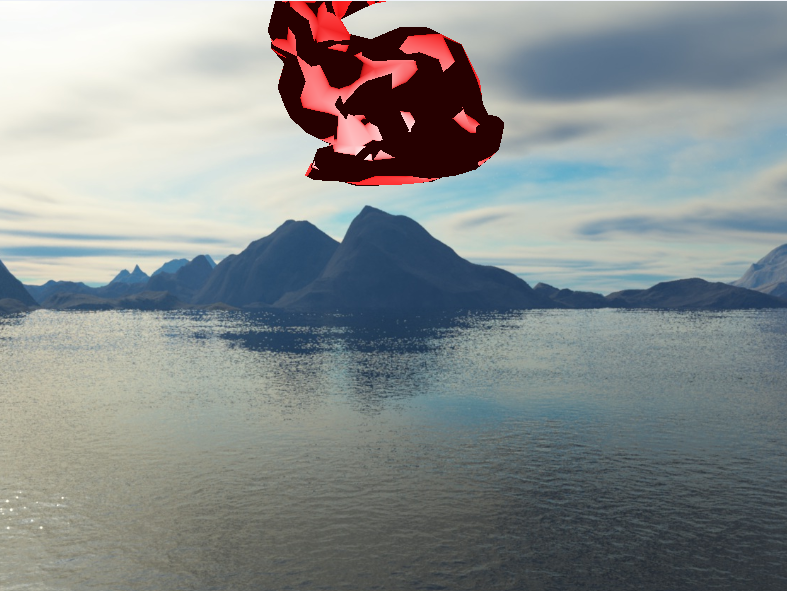
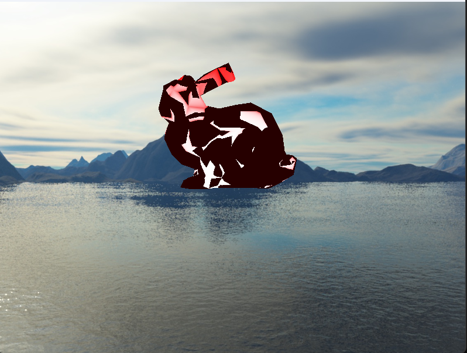

#### 简介 &nbsp;
$\qquad$ PBD的简单实现，在doyubkim的流体框架上扩展了PBD算法。原计划实现IBL算法，但由于bunny模型是从Matthias Müller的“十分钟物理”教程中提取的，并没有法线信息，所以暂时没有完成。这也是图示中存在黑色部分的原因，根据三角面片还原的法线方向无法判断内外。

#### 环境 &nbsp;
$\qquad$ MSVC(_MSC_VER=1934)

#### 效果图示 &nbsp;

